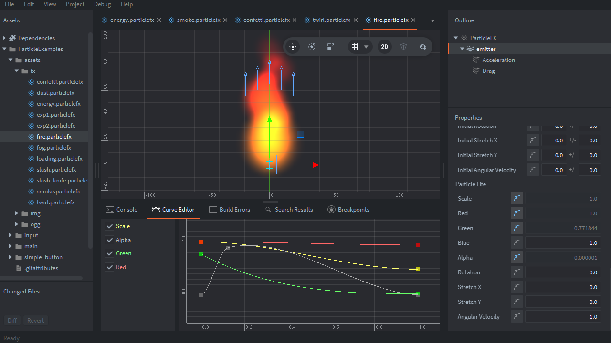
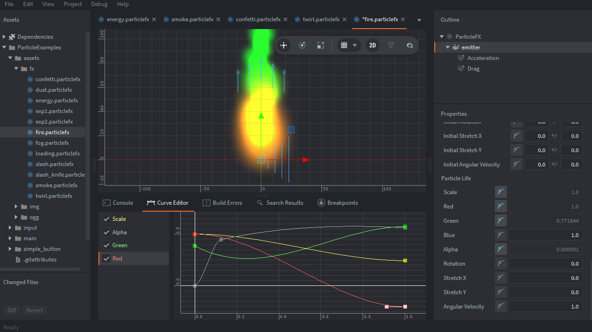

----

# 🌟 Defold Particle Effects Example Pack 🌟

This is a **sample project** featuring highly versatile **particle effects** for the **Defold engine**.
It includes **12 types** of effects that can be used immediately in various game genres such as Action, RPG, and Puzzle.

-----

-----

## 📂 Particle List

The following effects are located in the `particles` folder within the project:

  * ✨ **dust**: Enjoy the color transitions.
  * 💎 **energy**: Healing points on the field.
  * 💥 **exp1**: Standard explosion.
  * 🎉 **exp2**: Celebration cracker.
  * 🕯️ **fire**: Candle flame.
  * 🔄 **loading**: Loop animation suitable for UI.
  * ⚔️ **slash**: Trajectory of a sword or melee attack.
  * 🔪 **slash\_knife**: For daggers or sharp slashing effects.
  * 💨 **smoke**: Added a little bit of swaying motion.
  * 🌀 **twirl**: Loop animation suitable for UI.
  * 🌫️ **fog**: Useful for obscuring the screen.
  * 🎊 **confetti**: Goal / Victory celebration.

-----

## 🛠 How to Use (Beginner's Guide)

### 1\. How to check the project

1.  **Download as Zip** from this repository, or **Clone** it using Git.
2.  Open **Defold Editor** and select `game.project` to launch.
3.  **Build (`Ctrl + B` or `Cmd + B`)** to see all the effects in action on your screen.

### 2\. How to import into your own project

1.  Copy the **`.particle` files** you want to use (along with related textures and atlases) into your project folder.
2.  In your Collection or Game Object, select **`Add Component File`** → **The `.particle` file** you want to use.
3.  Call **`particlefx.play("#component_id")`** from your script to play the effect.

-----

## 💡 Tips for Customization

Defold particles can be finely adjusted within the editor.

### 📈 Utilize the Curve Editor

By clicking the **graph icon** next to each item in the particle settings (**Size, Rotation, Color, Alpha, etc.**), you can edit them using the **Curve Editor**.

Don't just change the numbers—**drag the graph shapes freely** to create your own unique effects\!

-----

## 🎨 Assets

**kenney**
[https://kenney.nl/](https://kenney.nl/)

-----

## ⚖️ License

**CC0**

-----

### 🚀 Happy Defolding\!

-----
